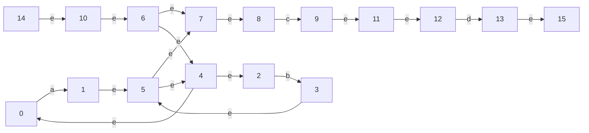

constructing NFA:  
stateID: 0, accepting: 0  
stateID: 1, accepting: 1  
0 —— a ——> 1  
stateID: 2, accepting: 0  
stateID: 3, accepting: 1  
2 —— b ——> 3  
stateID: 4, accepting: 0  
stateID: 5, accepting: 1  
4 —— e ——> 0  
4 —— e ——> 2  
1 —— e ——> 5  
3 —— e ——> 5  
stateID: 6, accepting: 0  
stateID: 7, accepting: 1  
6 —— e ——> 4  
5 —— e ——> 4  
5 —— e ——> 7  
6 —— e ——> 7  
stateID: 8, accepting: 0  
stateID: 9, accepting: 1  
8 —— c ——> 9  
stateID: 10, accepting: 0  
stateID: 11, accepting: 1  
10 —— e ——> 6  
7 —— e ——> 8  
9 —— e ——> 11  
stateID: 12, accepting: 0  
stateID: 13, accepting: 1  
12 —— d ——> 13  
stateID: 14, accepting: 0  
stateID: 15, accepting: 1  
14 —— e ——> 10  
11 —— e ——> 12  
13 —— e ——> 15  

final NFA:
