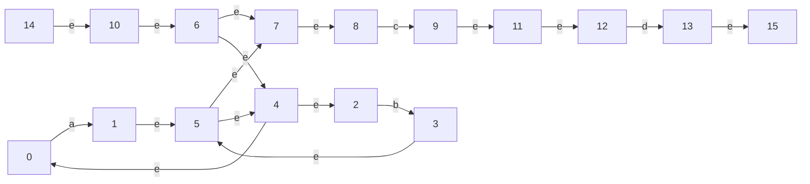

# 正则表达式->NFA 的 Thompson 构造法
## 描述正则表达式的 CFG

正则表达式的自然语言描述如下：  
1. 最简单的正则表达式是一个基本符号构成的（形如 `a`）；
2. Thompson 算法中，子正则表达式构造复杂正则表达式的操作只有三种：连接、或、闭包；
3. 三者中优先级最高的是闭包，其次是连接，最后是或；
4. 括号括起来的内容——无论里面有什么——都会成为优先级最高的项。  

由此，可以设计描述正则表达式的 CFG：  
```
lines -> lines|concat
lines -> concat  
concat -> concat basic  
concat -> basic  
basic -> basic*  
basic -> 'a'
...
basic -> 'Z'
basic -> (lines)  
```

## 设计基于 Thompson 构造法的翻译模式

在实现 Thompson 算法之前，最重要的是先完成 NFA 数据结构的设计。  
NFA 表示为由有限状态集、输入符号集、状态转换函数、唯一初态、唯一终态组成的五元组。其中，初态和终态都可以表示为状态的属性（是否接受），输入符号集即为状态转换函数中输入符号的集合；因此，实际上重要的只有状态集和状态转换函数。  

首先设计状态结构体 `struct state`，成员变量有它的名字 `id` 和布尔属性是否接受 `accepting`；  
然后设计状态转换函数结构体 `struct transition`，成员变量有它的当前状态 `source`，输入符号 `symbol` 和转换后状态 `destination`；  
最后是 NFA 结构体 `struct NFA`，成员变量有它的唯一初态 `start` 和唯一终态 `accept`。  

为了表示简单，此处不维护 NFA 的状态集，因为 NFA 是有方向的，有了前面的状态及其输出边，就可以推出后面的状态；事实上，连状态转换函数也不必维护，将其挂到它的源状态结构体中，连成一个链表，这样每得到一个新状态，就可以直接往后推，NFA 成为一个有向图。

于是，最终的 NFA 数据结构设计如下：  

```c
typedef struct state state;
typedef struct transition transition;
struct state{
    int id;
    bool accepting;
    //从该状态出发的所有转换连接成的链表
    transition* transitions; 
};
struct transition{
    char symbol;
    state *source;
    state *destination;
    transition* next;
};
struct NFA{
    state* start;
    state* accept;
};
// 为了状态命名方便，维护一个状态数的变量
int statecount = 0;
```

数据结构设计完成后，就可以实现 Thompson 算法，其中原子操作有两个，分别是构建新状态和添加状态转换：  

```c
//创建状态，标记是否接受
state* createState(bool accepting){
    state* s = new state;
    s->id = statecount++;
    s->accepting = accepting;
    s->transitions = NULL;
    return s;
}

//添加状态转换
void addTransition(state* from, char symbol, state* to){
    transition* t = new transition;
    t->symbol = symbol;
    t->source = from;
    t->destination = to;
    //把该转换挂到所在链表的头部
    t->next = from->transitions;
    from->transitions = t;
}
```

构建基本符号 NFA 的实现如下：

```c
//形如 a 的正则表达式的NFA
NFA fromsymbol(char symbol){
    state* start = createState(false);
    state* accept = createState(true);
    addTransition(start, symbol, accept);
    return (NFA){start, accept};
}
```

子 NFA 组合为复杂 NFA 的三个规则函数（连接、或、碧波啊）比较容易，仿照上述形式，对照图示创建状态、添加状态转换即可，唯一需要注意的是要把子 NFA 的终态修改为不接受（代码略）。

## 借助 Yacc 对 CFG 进行语法分析及翻译

把前面的内容组合起来写入 yacc 文件，将上述 CFG 改写成定义 token 和语义动作的语句，增加打印 NFA 的函数，就完成了正则表达式 -> NFA 的转换程序。

规则段如下，`myNFA` 是最终构建结束时的 NFA：  

```yacas
lines   :   lines OR concat { $$ = unionNFA($1,$3); myNFA = $$;}
        |   concat { $$ = $1; myNFA = $$;}
        ;

concat  :   concat basic    { $$ = concatNFA($1,$2); }
        |   basic   { $$ = $1; }
        ;

basic   :   basic STAR  { $$ = closureNFA($1); }
        |   CHAR    { $$ = fromsymbol($1); }
        |   LPAREN lines RPAREN { $$ = $2; }
        ;
```

为直观展示 NFA 构建的过程，在创建状态和添加状态转换的函数里加上输出语句，每增加一个状态或转换，就打印出来。

最后打印整个 NFA 时，采用 BFS 算法遍历所有状态，每遇到一个新状态就打印它的所有输出边，输出成 mermaid 流程图格式以便阅读。

测试用例 `(a|b)*cd`，输出 NFA 构建过程如下：

```c
// a  
stateID: 0, accepting: 0  
stateID: 1, accepting: 1  
0 —— a ——> 1  
// b  
stateID: 2, accepting: 0  
stateID: 3, accepting: 1  
2 —— b ——> 3  
// a|b  
stateID: 4, accepting: 0  
stateID: 5, accepting: 1  
4 —— e ——> 0  
4 —— e ——> 2  
1 —— e ——> 5  
3 —— e ——> 5  
// (a|b)*  
stateID: 6, accepting: 0  
stateID: 7, accepting: 1  
6 —— e ——> 4  
5 —— e ——> 4  
5 —— e ——> 7  
6 —— e ——> 7  
// c  
stateID: 8, accepting: 0  
stateID: 9, accepting: 1  
8 —— c ——> 9  
// (a|b)*c  
stateID: 10, accepting: 0  
stateID: 11, accepting: 1  
10 —— e ——> 6  
7 —— e ——> 8  
9 —— e ——> 11  
// d  
stateID: 12, accepting: 0  
stateID: 13, accepting: 1  
12 —— d ——> 13  
// (a|b)*cd  
stateID: 14, accepting: 0  
stateID: 15, accepting: 1  
14 —— e ——> 10  
11 —— e ——> 12  
13 —— e ——> 15  
```

输出 NFA 图示如下：  



测试正确。